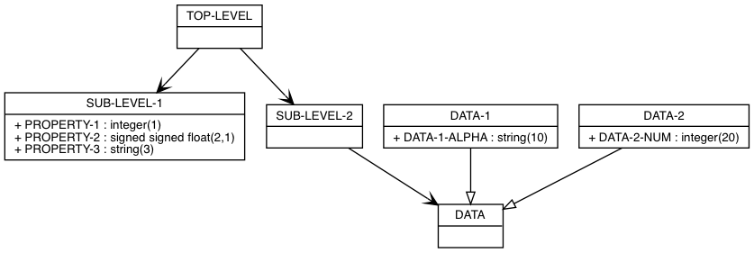

# Cobol Object Mapper

A Cobol (Copybook) parser that produces a corresponding class hierarchy
Christophe VG (<contact@christophe.vg>)  
[https://github.com/christophevg/cobol-object-mapper](https://github.com/christophevg/cobol-object-mapper)

## Introduction

This [Cobol parser](src/cobol.cs) for this project was generated using the [Human Parser Generator](https://github.com/christophevg/human-parser-generator). It produces an AST for copybook record definitions. These definitions are transformed in a basic class hierarchy, consisting of classes with properties and associations to other classes, thus mimicking the hierarchical copybook records. Redefining records are transformed into subclasses of the redefined record that is explicitly generated as an additional class.

**Disclaimer** I'm not aiming for feature completeness and only add support for what I need at a given time ;-)

## Example

Given an [example copybook](example.cobol):

```cobol
10 TOP-LEVEL.
   20 SUB-LEVEL-1.
      30 PROPERTY-1 PIC 9.
      30 PROPERTY-2 PIC S9.9.
      30 PROPERTY-3 PIC XXX.
   20 SUB-LEVEL-2.
      30 DATA PIC X(999).
      30 DATA-1 REDEFINES DATA.
         40 DATA-1-ALPHA PIC X(10).
      30 DATA-2 REDEFINES DATA.
         40 DATA-2-NUM PIC 9(20).
```

the Cobol Object Mapper generates the following class hierarchy, in the form of an object `Model` constructed from `Class`, `Property` and `Association` classes.

```bash
$ make INPUT=assets/example.cobol
*** Importing assets/example.cobol
*** Mapping...
*** Dumping Text format
- SUB-LEVEL-1
  - PROPERTY-1 : integer
  - PROPERTY-2 : signed float
  - PROPERTY-3 : string
- DATA-1 : DATA
  - DATA-1-ALPHA : string
- DATA-2 : DATA
  - DATA-2-NUM : integer
- DATA
- SUB-LEVEL-2
  -> DATA
- TOP-LEVEL
  -> SUB-LEVEL-1
  -> SUB-LEVEL-2
```

Besides this textual representation, a Graphviz Dot output format is also provided:

```bash
$ make dot INPUT=assets/example.cobol
*** Importing assets/example.cobol
*** Mapping...
*** Dumping Dot format
```

This generates a PNG file [`assets/example.cobol.png`](assets/example.cobol.png) (this name can be changed using the `OUTPUT=` Makefile variable):


